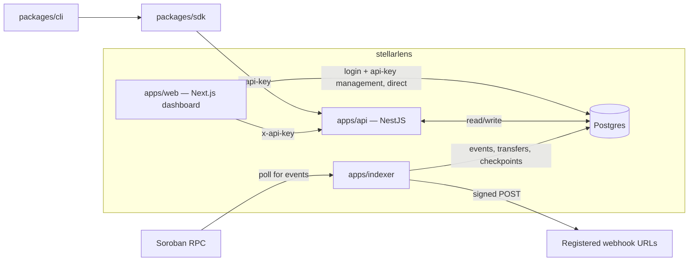

# stellarlens

**Live:** [stellarlens-web.vercel.app](https://stellarlens-web.vercel.app)

## What is stellarlens?

stellarlens is an indexing and monitoring platform for [Soroban](https://soroban.stellar.org/)
smart contracts on Stellar. Register a contract address, and stellarlens:

- polls Soroban RPC for that contract's events and decodes them (raw XDR alongside native values),
- detects SEP-41 token transfers and tracks volume/sender/receiver stats,
- fires signed webhooks to your own endpoints as new events land,
- and surfaces all of it in a login-gated web dashboard, a REST api, a typed SDK, and a CLI.

## Architecture



Everything but the dashboard's own login and api-key management goes through the api, which is the
single source of truth gated by `x-api-key`. The dashboard talks to Postgres directly only for the
one thing that can't depend on an api key existing yet: creating the first one (see
[`apps/web/lib/apiKeys.ts`](apps/web/lib/apiKeys.ts) if you're curious why).

## Tech stack

- **Package manager**: pnpm (workspaces), pinned via `packageManager` in root `package.json`
- **Build orchestration**: Turborepo (`turbo.json`)
- **Language**: TypeScript everywhere, strict mode
- **Lint/format**: ESLint 9 flat config + Prettier
- **API** (`apps/api`): NestJS, api-key auth, per-key rate limiting
- **Indexer** (`apps/indexer`): a polling worker, no framework — decodes XDR, detects transfers, delivers webhooks
- **Web** (`apps/web`): Next.js 14 App Router, Tailwind, session-cookie auth gating every route
- **SDK** (`packages/sdk`): typed client for the api, published as `@stellarlens/sdk`
- **CLI** (`packages/cli`): `stellarlens contracts add/list`, `stellarlens events tail`, built on the SDK
- **DB** (`packages/db`): Drizzle ORM + Postgres, `drizzle-kit` for migrations
- **CI**: GitHub Actions — install, lint, typecheck, build, test on every push and PR

## Monorepo layout

```
apps/
  api/       NestJS API — contracts, events, transfers, stats, api keys
  web/       Next.js dashboard — login, contracts/events/transfers views, settings
  indexer/   Polls Soroban RPC, writes events/transfers, delivers webhooks
packages/
  sdk/       Typed TypeScript client for the api (@stellarlens/sdk)
  cli/       Command-line tool built on the sdk (@stellarlens/cli)
  db/        Drizzle schema, migrations, and the shared db client
docs/        Supplementary docs (see docs/screenshots.md)
.github/     CI workflow, CONTRIBUTING.md, CODE_OF_CONDUCT.md, PR/issue templates
docker-compose.yml   Local Postgres + Redis
.env.example         Root-level env vars for db/indexer; apps/web and apps/api have their own
```

Workspaces are `apps/*` and `packages/*` (see `pnpm-workspace.yaml`), scoped as `@stellarlens/<name>`.

## Quickstart

```bash
git clone https://github.com/cyfer-codes/stellarlens.git
cd stellarlens
pnpm install
cp .env.example .env
docker compose up -d postgres redis   # Postgres on localhost:5433, Redis on 6379

pnpm --filter @stellarlens/db db:migrate
pnpm --filter @stellarlens/web seed-admin   # SEED_ADMIN_EMAIL / SEED_ADMIN_PASSWORD env vars

pnpm dev   # starts every app in watch mode
```

Then open the web dashboard (default `:3000` — see the per-workspace table below for exact ports and
env vars each app needs), log in with the seeded admin account, and generate your first api key from
**Settings**.

| Workspace | Dev command | Notes |
|---|---|---|
| `apps/api` | `pnpm --filter @stellarlens/api dev` | Listens on `:3000` by default (`PORT` overrides). `GET /health` is public |
| `apps/web` | `pnpm --filter @stellarlens/web dev` | Also defaults to `:3000` — run with a different `PORT` if both are up. Needs `API_URL`, `API_KEY`, `DATABASE_URL`, `SESSION_SECRET` (see `apps/web/.env.example`) |
| `apps/indexer` | `pnpm --filter @stellarlens/indexer dev` | Needs `DATABASE_URL`, `SOROBAN_RPC_URL`, `STELLAR_NETWORK` |
| `packages/sdk` | `pnpm --filter @stellarlens/sdk dev` | `tsup --watch` |
| `packages/cli` | `pnpm --filter @stellarlens/cli dev` | Needs `STELLARLENS_API_URL` / `STELLARLENS_API_KEY` to actually run the built binary — see `packages/cli/README.md` |
| `packages/db` | n/a (library) | `db:generate` / `db:migrate` / `db:studio` wrap `drizzle-kit`; needs `DATABASE_URL` and Postgres running |

Full pipeline check before opening a PR:

```bash
pnpm lint
pnpm typecheck
pnpm build
pnpm test
```

## Docs

- [docs/screenshots.md](docs/screenshots.md) — what to capture for the README's (forthcoming) visuals section
- Deployment: see the Render + Vercel runbook shared separately (ask if you need it re-sent)

## Coding conventions

- **Commit messages**: single line, lowercase, imperative mood, no period — e.g.
  `add health check endpoint to api`. No AI attribution lines — commits should read as if written
  directly by the maintainer.
- **Match existing style** in whatever file/package you're editing. Root ESLint/Prettier config
  governs formatting — run `pnpm lint` before committing.
- **Don't add speculative abstractions or dependencies** without a reason tied to the task at hand.
- **Build artifacts are gitignored** (`dist/`, `.next/`, `.turbo/`, `*.tsbuildinfo`) — never commit them.

## Contributing

Contributions are welcome — see [`.github/CONTRIBUTING.md`](.github/CONTRIBUTING.md) for the full
guide (setup, branch/PR flow, style). New to the codebase? Look for issues tagged
[`good first issue`](https://github.com/cyfer-codes/stellarlens/labels/good%20first%20issue) — they're
scoped to be a reasonable first contribution. Please also read the
[Code of Conduct](.github/CODE_OF_CONDUCT.md) before participating.
